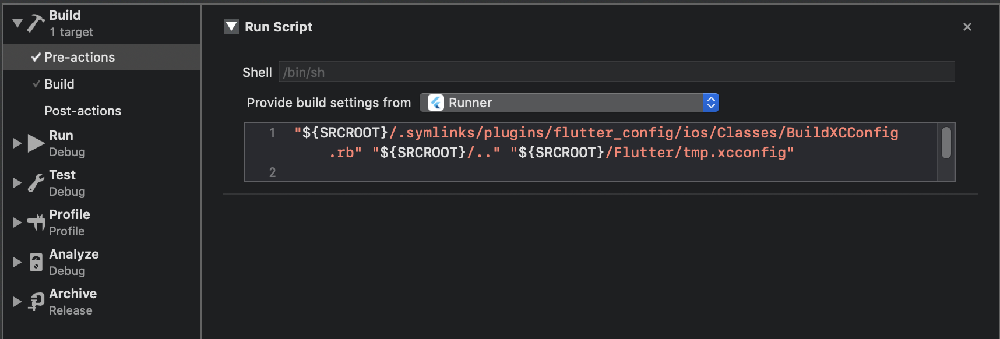
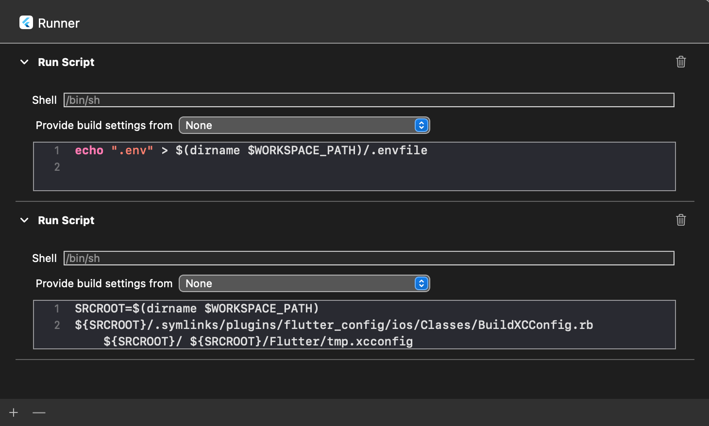

## iOS Advanced Setup

No additional setup is required is you are only reading env varibles from Obj-C/Swift code.

Read variables declared in `.env` from your Obj-C classes like:

```objective-c
// import header
#import "FlutterConfigPlugin.h"

// then read individual keys like:
NSString *apiUrl = [FlutterConfigPlugin envFor:@"API_URL"];

// or just fetch the whole config
NSDictionary *config = [FlutterConfigPlugin env];
```

### Availability in Build settings and Info.plist

Extra steps are required if you are reading env varibles from your `info.plist` file

1. Under `Runner/Flutter`:
   
   You need to add the following code to both `Debug.xcconfig` and `Release.xcconfig`

   ```objective-c
   #include? "tmp.xcconfig"
   ```

2. In the Xcode menu, go to Product > Scheme > Edit Scheme
   

3. under Build > Pre-actions you need to add a new run script action with the following code:
   

   ```
   "${SRCROOT}/.symlinks/plugins/flutter_config/ios/Classes/BuildXCConfig.rb" "${SRCROOT}/.." "${SRCROOT}/Flutter/tmp.xcconfig"
   ```

4. Choose the target you're building for (in this case "Runner") under "Provide build settings from"
   

5. You need to do this for both your `Debug` and `Release` Schemes.

This should now create a `tmp.xcconfig` file which can be accessed by `info.plist`

### Different environments

The basic idea in iOS is to have one scheme per environment file, so you can easily alternate between them.

Start by creating a new scheme:

- In the Xcode menu, go to Product > Scheme > Edit Scheme
- Click Duplicate Scheme on the bottom
- Give it a proper name on the top left. For instance: "Myapp (staging)"

Then edit the newly created scheme to make it use a different env file. From the same "manage scheme" window:

- Expand the "Build" settings on left
- Click "Pre-actions", and under the plus sign select "New Run Script Action"
- Where it says "Type a script or drag a script file", type:

```
echo ".env.staging" > /tmp/envfile   # replace .env.staging for your file
```

By default, flutter_config will always pickup the `.env` file as the default file unless a
`/tmp/enfile` is detected. This means that all your iOS schemes with custom `.env` files should include:

```
echo ".env.yuorCustomEnv" > /tmp/envfile
```

As a pre-build action. The end result should look something like this:



It may be a better Idea not modifying system-wide files like /tmp/envfile
but instead set the file in the current directory, I have been trying to implement this but may need some help, [See #2](https://github.com/ByneappLLC/flutter_config/issues/2)

This is still a bit experimental and dirty – let us know if you have a better idea on how to make iOS use different configurations opening a pull request or issue!
